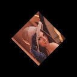

OpenCV bindings for LuaJIT+Torch
=====================

For complete info on the project, visit its [Wiki](https://github.com/VisionLabs/torch-opencv/wiki).

See [this page](https://github.com/VisionLabs/torch-opencv/wiki/Trying-it-out) for a watching-demos quickstart.

#Tutorial

This section showcases code snippets to use basic image based [OpenCV](http://opencv.org/) functionalities. Using the famous Lena image for this purpose.

###Requiring torch-opencv
OpenCV provides range of functionalities. You can require them as required.
```lua
local cv = require 'cv'
require 'cv.imgcodecs' -- reading/writing images
require 'cv.imgproc' -- image processing
require 'cv.highgui' -- GUI
require 'cv.ml' -- Machine Learning
require 'cv.videoio' -- Video
```

###Reading/writing image
OpenCV reads image in row major format and shape is (height, width, channels) unless the image is loaded as grayscale or it is grayscale and loaded with ```cv.IMREAD_UNCHANGED``` flag, in that case the shape is (height, width). Functions ```cv.imread``` and ```cv.imwrite``` reverses the channel order. If the image is in RGB on disk then after reading it becomes BGR (in memory) and vice-versa for image writing.

To load image as it is on disk.
```lua
loadType = cv.IMREAD_UNCHANGED
src = cv.imread{imagePath, loadType}
print(src:size())
 512
 512
   3
[torch.LongStorage of size 3]
```

To load the image as color image use cv.IMREAD_COLOR flag.
```lua
--loadType: cv.IMREAD_COLOR, loads (always) 3 channel image.
loadType = cv.IMREAD_COLOR
src = cv.imread{imagePath, loadType}
print(src:size())
 512
 512
   3
[torch.LongStorage of size 3]
```

You can use cv.IMREAD_GRAYSCALE to load image as grayscale.
```lua
loadType = cv.IMREAD_GRAYSCALE
src = cv.imread{imagePath, loadType}
print(src:size())
 512
 512
[torch.LongStorage of size 2]
```

To save image to disk
```lua
cv.imwrite{imagePath, src}
```

###Color Conversion
Opencv provides optimized color conversion functions.

Convert BGR to YUV
```lua
dst = src:clone()
cv.cvtColor{src=src, dst=dst, code=cv.COLOR_BGR2YUV}
print(dst:size())

 512
 512
   3
[torch.LongStorage of size 3]
```

Convert to grayscale
```lua
dst = cv.cvtColor{src=src, code=cv.COLOR_BGR2GRAY}
print(dst:size())

 512
 512
[torch.LongStorage of size 2]
```

###Resize image
Resize an image to given fixed size.
```lua
dst = cv.resize{src=src, dsize={1024, 1024}, interpolation=cv.INTER_CUBIC}
print(dst:size())

 1024
 1024
    3
[torch.LongStorage of size 3]
```

Resize image by a given factor. You can use different scaling factor for height and width.
```lua
scale = 0.25
dst = cv.resize{src=src, fx=scale, fy=scale, interpolation=cv.INTER_AREA}
print(dst:size())

 128
 128
   3
[torch.LongStorage of size 3]
```

###Affine transformation
Source image


1) Get affine rotation/scaling matrix. ```lua

```lua
height = src:size(1)
width = src:size(2)

-- rotate counter clockwise about center (in image coordinate system)
center = cv.Point2f{width/2, height/2}
angle = 45 -- in degrees
scale = 0.5

-- get rotation matrix
M = cv.getRotationMatrix2D{center=center, angle=angle, scale=scale}
print(M:size())
 2
 3
[torch.LongStorage of size 2]
```
Transformation matrix M provided by Opencv has only rotation and scaling. You can add translation by adding [translationX translationY] to the last column of M.


2) Transforming image
```lua
dsize = cv.Size{width, height} -- if not provided or zero then uses source image size
dst = cv.warpAffine{src=src, M=M, dsize=dsize, flags=cv.INTER_LINEAR}
print(dst:size())

 512
 512
   3
[torch.LongStorage of size 3]
```

Affine transformed image


