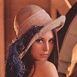

OpenCV bindings for LuaJIT+Torch
=====================

For complete info on the project, visit its [Wiki](https://github.com/VisionLabs/torch-opencv/wiki).

See [this page](https://github.com/VisionLabs/torch-opencv/wiki/Trying-it-out) for a watching-demos quickstart.

#Tutorial

This section showcases code snippets to use basic image based Opencv functionalities. Using the famous Lena image for this purpose.

###Requiring torch-opencv
```lua
local cv = require 'cv'
require 'cv.imgcodecs' -- reading/writing images
require 'cv.imgproc' -- image processing
```

###Reading/writing image
```lua
-- loading image from disk
-- cv.imread loads image in row-major format

--loadType: cv.IMREAD_UNCHANGED,  loads image as it is on disk.
loadType = cv.IMREAD_UNCHANGED
src = cv.imread{imagePath, loadType}
print(src:size())
 512
 512
   3
[torch.LongStorage of size 3]

--loadType: cv.IMREAD_COLOR, loads (always) 3 channel image.
loadType = cv.IMREAD_COLOR
src = cv.imread{imagePath, loadType}
print(src:size())
 512
 512
   3
[torch.LongStorage of size 3]

--loadType: cv.IMREAD_GRAYSCALE, returns grayscale converted image
loadType = cv.IMREAD_GRAYSCALE
src = cv.imread{imagePath, loadType}
print(src:size())
 512
 512
[torch.LongStorage of size 2]

-- Saving image to disk
cv.imwrite{imagePath, src}
```

###Color Conversion
cv.imread and cv.imwrite reverses color order. If the image is in RGB (on disk) format then after reading it becomes BGR (in memory) and vice-versa for imwrite.
```lua

-- Convert BGR to YUV
dst = src:clone()
cv.cvtColor{src=src, dst=dst, code=cv.COLOR_BGR2YUV}
print(dst:size())

 512
 512
   3
[torch.LongStorage of size 3]

-- Convert to grayscale
dst = cv.cvtColor{src=src, code=cv.COLOR_BGR2GRAY}
print(dst:size())

 512
 512
[torch.LongStorage of size 2]
```

###Resize image
```lua
print(src:size())

 512
 512
   3
[torch.LongStorage of size 3]

-- resize to fixed size
dst = cv.resize{src=src, dsize={1024, 1024}, interpolation=cv.INTER_CUBIC}
print(dst:size())

 1024
 1024
    3
[torch.LongStorage of size 3]

-- resize by scale
scale = 0.25
dst = cv.resize{src=src, fx=scale, fy=scale, interpolation=cv.INTER_AREA}
print(dst:size())

 128
 128
   3
[torch.LongStorage of size 3]
```

###Affine transformation
```lua


height = src:size(1)
width = src:size(2)

-- rotate counter clockwise about center (in image coordinate system)
center = cv.Point2f{width/2, height/2}
angle = 45 -- in degrees
scale = 0.5

-- get rotation matrix
M = cv.getRotationMatrix2D{center=center, angle=angle, scale=scale}
-- This transformation matrix M has only rotation and scaling. You can add translation by adding [tx ty] to the last column of M.

-- get transformed image
dsize = cv.Size{width, height} -- if not provided or zero then uses source image size
dst = cv.warpAffine{src=src, M=M, dsize=dsize, flags=cv.INTER_LINEAR}
print(dst:size())

 512
 512
   3
[torch.LongStorage of size 3]
```
